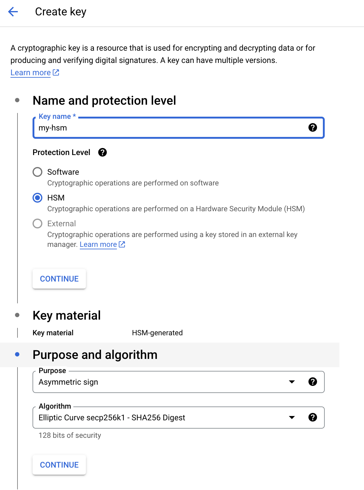

# @valora/viem-account-hsm-gcp

[](https://github.com/valora-inc/viem-account-hsm-gcp/blob/main/LICENSE)
[](https://www.npmjs.com/package/@valora/viem-account-hsm-gcp)
[](https://github.com/valora-inc/viem-account-hsm-gcp/actions/workflows/workflow.yaml?query=branch%3Amain)
[](https://codecov.io/gh/valora-inc/viem-account-hsm-gcp)
[](https://github.com/valora-inc/viem-account-hsm-gcp#contributing)

Use a Google Cloud HSM key to sign transactions with [viem](https://viem.sh/).

## Installing the library

```
yarn add @valora/viem-account-hsm-gcp
```

Note: viem is a peer dependency, so make it sure it's installed in your project.

## Using the library

### Simple usage

```typescript
import { createWalletClient, http } from 'viem'
import { mainnet } from 'viem/chains'
import { gcpHsmToAccount } from '@valora/viem-account-hsm-gcp'

const account = await gcpHsmToAccount({
  hsmKeyVersion:
    'projects/your-gcp-project/locations/global/keyRings/your-keyring/cryptoKeys/your-hsm/cryptoKeyVersions/1',
})

const client = createWalletClient({
  account,
  chain: mainnet,
  transport: http(),
})

// Test send a transaction to the HSM key (the HSM key needs to be funded)
const hash = await client.sendTransaction({
  to: account.address,
  value: parseEther('0.001'),
})
```

> [!IMPORTANT]  
> Make sure the key in [Google Cloud KMS](https://console.cloud.google.com/security/kms/keyrings) is a secp256k1 key.



> [!TIP]
> You don't have to use an HSM key, you can use a software key as well. See the [Google Cloud KMS documentation](https://cloud.google.com/kms/docs/algorithms#protection_levels) for more information.

## Resources

- [viem](https://viem.sh/)
- [@google-cloud/kms](https://www.npmjs.com/package/@google-cloud/kms)

## Acknowledgements

This library is a port of [@celo/wallet-hsm-gcp](https://github.com/celo-org/developer-tooling/tree/0c61e7e02c741fe10ecd1d733a33692d324cdc82/packages/sdk/wallets/wallet-hsm-gcp) to viem.

Big thanks to the Celo team for the original implementation.

## Contributing

- [Reporting issues](https://github.com/valora-inc/viem-account-hsm-gcp/issues)
- [Submitting a pull request](https://github.com/valora-inc/viem-account-hsm-gcp/pulls)
- Publishing updates is done automatically via [semantic-release](https://github.com/semantic-release/semantic-release).
  Remember to use [conventional commits](https://www.conventionalcommits.org/en/v1.0.0/) or your PR will be rejected (since
  merging it would mess up the changelog and version numbers).
